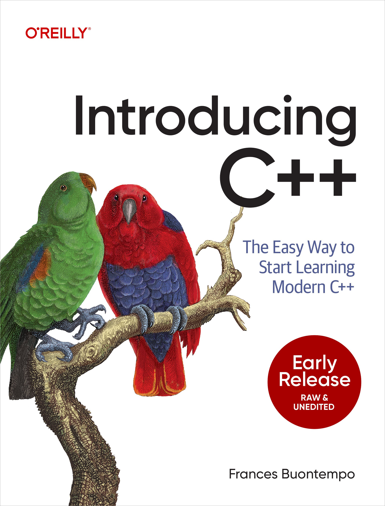

# IntroducingCpp

This repo contains the code for [Introducing C++](https://www.oreilly.com/library/view/introducing-c/9781098178130/)



Each folder contains code for the corresponding book chapter. 

## Get some tools

You'll need tools installed to builld the code. 
You may already have some installed. 
For Linux or MacOS, try one of the following command at a prompt: 

```
g++ --version
```

or 
```
clang++ --version
```

If neither works, you need to install one of these. 

If you are using Windows, you may have `g++` or `clang++` or you can install Visual Studio. 
You can get `g++` or `clang++` from [Mingw](https://www.mingw-w64.org/) or Visual Studio from the [Community edition page](https://visualstudio.microsoft.com/vs/community/). 
If you open a developer command prompt, you can see the version number of your compiler like this:

```
cl --version
```

This book shows you how to build your code from a prompt. 
You can find an app instead, for example Jet Brain's [CLion](https://www.jetbrains.com/clion/). 
Such tools provide a user interface, where you can click buttons to build and run code. 
If you try the prompt a little, it might help you remember what is happening behind the buttons clicks. 

## Build some code

Folder "chapter_01" has three source files, with extension "cpp". 
"hello.cpp" contains the following code: 

```
#include <iostream>

int main()
{
    std::cout << "Hello, world!\n"; 
}
```
The book talks through  the details. 
At a high level, `main` is the starting point of a C++ application. 
`std::cout` is one way to write output using `cout` (character output) for the standard (`std`) library. 

You can build a single file by stating your tool and the filename. 
For example, for `g++`, use

```
g++ chapter_01/hello.cpp
``` 

If you are using `clang++`, state that instead of `g++`. 
For Windows, you get a long warning about exceptions unless you specify `/EHsc` when you build. 
You can add this after `cl.exe`: 

```
IntroducingCpp>cl.exe /EHsc chapter_01\hello.cpp
```

(`cl.exe` is the compiler, one step in building C++ code. The book explains in more detail). 

You will either see a file called `a.out` or `a.exe` generated. 
You can then run this and will see a greeting on your prompt: 

```
IntroducingCpp>a.exe
Hello, world!
>
```

```
IntroducingCpp$ ./a.out
Hello, world!
$
```

Your first C++ program! 
Well done. 
